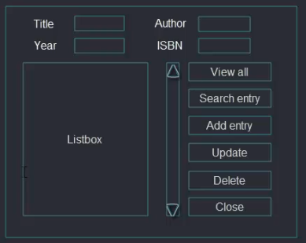
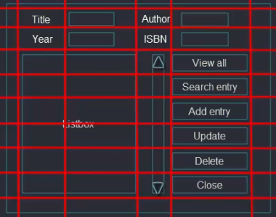

# Python - Book Store app using tkinter and sqlite3

## About ##

This coding example is part of a Udemy Python course using Python to build an executable app that uses the tkinter module for the frontend and sqlite3 database for the backend.

---

## UX ##

### **User Stories** ##

- As a user, I want to be able to open & close the app
- As a user, I want to view all records in the database
- As a user, I want to search for an entry in the database
- As a user, I want to be able to add a new entry
- As a user, I want to be able to update / edit an entry
- As a user, I want to be able to delete an entry

### **Wireframe** ###

- GUI Interface



- GUI Interface with tkinter grid layout



---

## Technologies ##

### **Languages** ###

- [Python3](https://www.python.org/)
  - Used to create the main application functionality

### **Libraries / Packages / Modules** ###

- [tkinter](https://docs.python.org/3/library/tkinter.html)
  - Used to build the frontend GUI interface

### **Databases** ###

- [sqlite3](https://docs.python.org/3/library/sqlite3.html)
  - Local .db file created using the Python sqlite3 module

### **Tools** ###

- [VS Code](https://code.visualstudio.com/)
  - Code Editor

---

## Deployment ##

The website was developed using VS Code & Git pushed to GitHub, which hosts the repository. I made the following steps to deploy the site:

### **Cloning book-store-app from GitHub** ###

#### **Prerequisites** ###

Ensure the following are installed locally on your computer:

- [Python 3.6 or higher](https://www.python.org/downloads/)
- [PIP3](https://pypi.org/project/pip/) Python package installer
- [Git](https://git-scm.com/) Version Control

#### **Cloning the GitHub repository** ####

- navigate to [simonjvardy/book-store-app](https://github.com/simonjvardy/books-store-app) GitHub repository.
- Click the **Code** button
- **Copy** the clone url in the dropdown menu
- Using your favourite IDE open up your preferred terminal.
- **Navigate** to your desired file location.

Copy the following code and input it into your terminal to clone Sportswear-Online:

```Python
git clone https://github.com/simonjvardy/books-store-app.git
```


#### **Creation of a Python Virtual Environment** ####


*Note: The process may be different depending upon your own OS - please follow this [Python help guide](https://python.readthedocs.io/en/latest/library/venv.html) to understand how to create a virtual environment.*

#### **Run the application locally** ####

- To run the book store application, enter the following command into the terminal window:

```Python
python3 frontend.py
```

---

## Acknowledgements ##

- [Udemy: The Python Mega Course - Build 10 Real World Applications](https://www.udemy.com/course/the-python-mega-course/) Credit: Ardit Sulce
